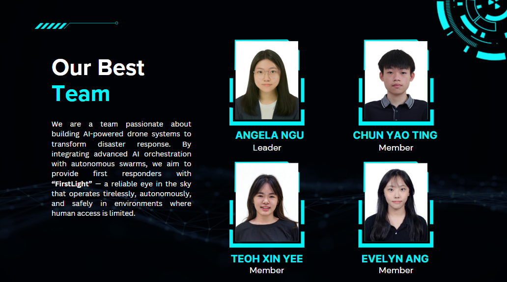
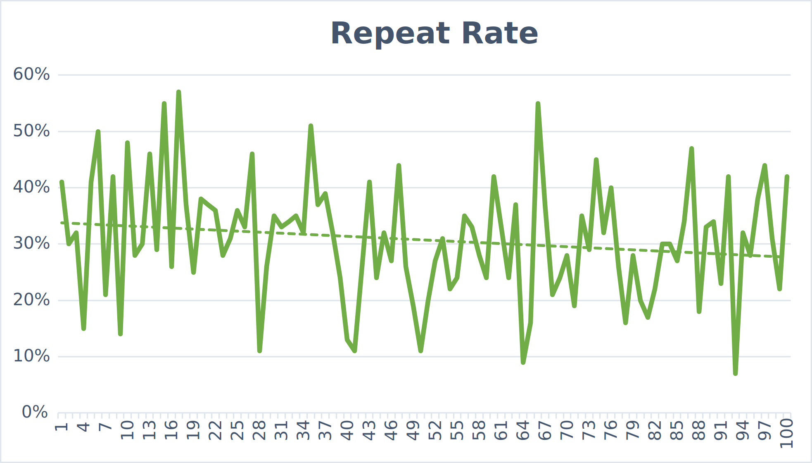
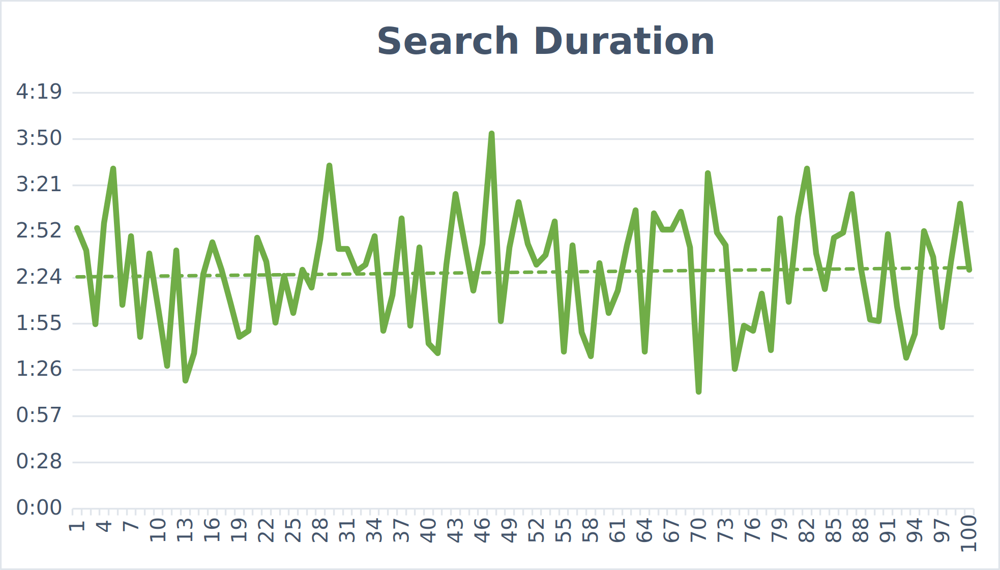

# 🚁 FirstLight: AI-Driven Multi-Resolution Swarm Simulation
> "First light in the darkest hour"

**FirstLight** is an AI-powered platform for decentralized drone swarm coordination in disaster scenarios.  
Powered by **Google Gemini (Vertex AI)** and built on the **Model Context Protocol (MCP)**, it enables intelligent, autonomous search and rescue in environments where communication is limited or unavailable.

### 🎥 Presentation Video
[FirstLight Demo Video](https://youtu.be/PZZi9-1bCK4?si=SAJaKxSruFuxnAjv)
<br/>
<sub>*(Click above to watch the project presentation and demo)*</sub>

### 📂 Presentation Slides
👉 [FirstLight Project Slides](./public/assets/FirstLight_Slides.pdf)


### 📝 AI Logic Chain Documentation
Detailed documentation on the AI decision-making loop and chain-of-thought orchestration can be found here:<br>
👉 [AI Logic Chain (Full Documentation)](./AI_LOGIC_CHAIN.md) <br>

👉 [AI Logic Chain (Demo Video)](https://drive.google.com/file/d/1D_WHpD9I6JZl3VmFjgsQrfZWHRI4QB2h/view?usp=sharing)

---

## 👥 Our Team

We are a team passionate about building AI-powered drone systems to transform disaster response. By integrating advanced AI orchestration with autonomous swarms, we aim to provide first responders with **"FirstLight"** — a reliable eye in the sky that operates tirelessly, autonomously, and safely in environments where human access is limited.



| Member | Role | Responsibility |
| :--- | :--- | :--- |
| **Angela Ngu Xin Yi** | Leader | **AI Orchestration**: Managing the Gemini decision loop, prompt engineering, and tactical intent generation. |
| **Chun Yao Ting** | Member | **MCP Infrastructure**: Developing the MCP server, defining tool schemas, and ensuring robust state synchronization. |
| **Teoh Xin Yee** | Member | **Simulation Logic**: Implementing drone autonomous algorithms, heatmap probability modeling, and swarm coordination. |
| **Evelyn Ang** | Member | **Visualization & UI**: Developing Geospatial 3D views (Cesium/MapLibre), real-time telemetry overlays, and tactical interface styling. |

---

## 🔎 Project Overview

### 🚩 The Challenge: The 72-Hour Blackout
In the ASEAN region, typhoons and earthquakes frequently trigger catastrophic communication blackouts. 
- **Centralized Failure**: Current rescue models rely on high-bandwidth cloud connectivity for processing and coordination. When infrastructure collapses, these centralized systems fail.
- **The "Golden Window"**: During the first 72 hours, disaster response is stalled due to zero connectivity and lack of coordinated intelligence. There is an urgent need for an **Autonomous Command Agent** that operates at the edge, independent of human pilots or cloud access.

### 🌍 SDG Alignment
- **SDG 3**: Good Health & Well-being (Target 3.d — Emergency Preparedness)
- **SDG 9**: Industry, Innovation, & Infrastructure (Target 9.1 — Resilient Infrastructure)

### 💡 The Solution: Edge-Based Swarm Intelligence
FirstLight moves the "brain" of the operation to the disaster zone itself:
- **Autonomous Command**: A Gemini-powered agent that maps disaster zones and orchestrates a fleet of drones via on-device AI.
- **MCP Tool Protocol**: Standardized, efficient management of drone resources via the Model Context Protocol.
- **Self-Healing Swarms**: Real-time management of battery, connectivity, and mission handoffs to ensure aid reaches survivors.

---

## 🔌 MCP Architecture

<div align="center">
  
</div>

### Functional Layers
- **Strategic Planning (LLM)**: The high-level mission "Brain" (Gemini) that processes swarm state to develop search strategies and operational intent.
- **Mission Orchestrator (Relay Drone)**: Responsible for executing high-level tactical commands (e.g., `assignHotspotBatch`, `getRecommendedActions`) derived from the LLM strategy.
- **MCP Client (Transmission Bridge)**: The secure interface that links the **Cognition Engine** to the **MCP Server**, translating strategic intent into standardized JSON-RPC tool requests.
- **MCP Server (Tool Registry)**:
    - **High-Level Tools**: Strategic tools for mission-wide monitoring and tactical batching.
    - **Low-Level Tools**: Operational tools for individual drone perspective and maneuvers.
    - **Comm & Relay Tools**: Manage the mesh network status and positioning of relay drones.

---

## 🔄 Mission Workflow

FirstLight operates in a continuous, high-fidelity orchestration loop:

```text
User launches FirstLight → Starts Simulation Scan
|
▼
Environment Sync → Ingest Map Tiles, Hazards, & Drone Telemetry
|
▼
Snapshot Generation → Anonymized JSON "World Model" Created
|
▼
AI Orchestration Loop (Gemini 2.5)
|
├── Analyze search grid probability (Heatmaps)
├── Evaluate battery & connectivity constraints
├── Strategize optimal hotspot allocation
└── Generate tactical intent
|
▼
MCP Action Execution → Translate intent to Discoverable Tools
|
├── setDroneTarget() → Direct movement
├── assignHotspotBatch() → Strategy dispatch
├── setDroneMode() → State transition
└── recallDroneToBase() → Safety management
|
▼
Swarm Execution & Feedback → Next Cycle Begins
|
├── Drones maneuver in 3D space
└── Sensor data streamed back to Simulation
```

> [!NOTE]  
> The workflow follows a strict **Sense → Think → Act** cycle, ensuring all drone maneuvers are grounded in real-time environmental data and strategic AI reasoning.

---

## 🚀 Innovations

### 🌍 Geospatial Predictive Nature
-   **Initial Probability Fusion**: Survivor probability is calculated by fusing **Building Density**, **Residential Factors**, and **Road Access**.
-   **Prioritized Searching**: Instead of starting with a blank map, the model focuses early search efforts on **high-density residential areas** to speed up the localization process.

### 🛰️ Blanket Search (Dual-Mode)
-   **Wide Scan**: The default mode, which detects initial signs of survivors for **rapid area coverage**.
-   **Micro Scan**: Automatically activated when a drone detects a high signal probability, performing repeated, high-precision scans to **investigate the signal**.

### 🎛️ Collaborative & Adaptive Sensors
-   **Multi-Sensor Fusion**: Integrates various sensors (Mobile, Thermal, Wi-Fi, Sound) to compute accurate arrival probabilities.
-   **Confidence Building**: In Micro Scan mode, drone sensors' confidence **builds up over time** to eliminate noise-based false positives.
-   **Dynamic Weighting**: As survivors are found, the AI **"learns"** which sensors are most reliable and **adjusts their weights** in real-time.

### 🧠 Global Perspective of Orchestrator
-   **Semantic Summarization**: Raw telemetry is compressed into a **Natural Language Summary**, allowing the AI to read the battlefield and make strategic decisions like a human commander.
-   **Exact State Understanding**: Every 10 ticks, the entire grid and drone status are passed to the AI, ensuring it understands the **exact battery level, position, and scanned state** of every cell.

### 🔋 Resource & Time Management
-   **Battery Forecasting**: Before assignment, the system runs a **Battery Forecast** to ensure drones have enough energy to return to base to charge.
-   **Task Handoff**: When a drone's battery is low, it **negotiates a handoff** with the nearest drone, passing its high-probability coordinates so the investigation continues without interruption.
-   **Information Decay (TTL)**: Confidence levels in previous negative results **decay over time**, triggering **re-verification** of areas to account for a changing disaster environment.

### 🛡️ Self-Healing & Connectivity
-   **Autonomous Relay Rotation**: A backup relay at base replaces a low-battery relay in the field without dropping connectivity for a single tick.
-   **Centroid-Based Optimization**: If drones are almost losing connection, the relay **moves toward the centroid** of the swarm to maximize coverage.
-   **Offline Buffer Strategy**: Drones continue scanning and store data in a local **Offline Buffer** during signal loss, which is "flushed" to the base the moment a connection is restored for **zero data loss**.

### 🤖 Real-Time Drone Discovery & Adaptation
-   **Dynamic Discovery**: Instead of hard-coded IDs, the system uses a centralized `droneStore` and the `getDroneDiscoveryList` tool to enumerate the active fleet in real-time.
-   **Fleet-Agnostic Orchestration**: The AI orchestrator "sees" the currently synced fleet via `buildStateSummary`, ensuring it only issues commands to active, healthy drones without reinventing IDs.
-   **Autonomous Scaling**: The `executeRegionBootstrap` logic dynamically partitions the search grid (Region Centers) based on the current drone count—automatically scaling the strategy if the fleet grows or shrinks.

## 🆕 Latest Updates

### 💎 Premium Mission Controls
FirstLight now features three premium operational modes giving commanders absolute authority over the swarm:
-   **🛰️ Blanket Search Mode**: The swarm defaults to a high-precision Micro Scan immediately upon deployment, ensuring every sector is thoroughly investigated for survivor signatures before moving on.
-   **🎯 Draw Area Mode**: Allows human operators to draw a custom boundary directly on the simulation map. This signals the AI orchestrator to place a heavy emphasis on searching within the drawn region, seamlessly blending human intuition with the AI's autonomous planning.
-   **⏱️ Time Budget Mode**: Introduces strict operational time windows where the orchestrator optimizes search trajectories for maximum coverage, prioritizing high-yield areas when time is severely constrained.

### 📊 Performance Analytics & Metrics
The system automatically tracks how long missions take, how often drones scan the same area, and how many survivors are found. This data is saved to a database to generate statistical trend lines and visualize the swarm's average response times across multiple simulation cycles.

### 🚨 Real-Time Situational Awareness
Integrated "important event" pop-outs and redesigned survivor detection panels ensure critical operational feedback is immediately visible. This high-fidelity UI guarantees that human operators are instantly alerted to mission-critical breakthroughs without suffering from cognitive overload.

### 🗺️ GPS-Inclusive Map View
The platform integrates real-time GPS connectivity with interactive, high-fidelity map overlays. This grounds the simulation in precise real-world coordinates, allowing for accurate geospatial mapping and planning within actual disaster zones.

### 🧠 Hybrid AI Orchestration
FirstLight features a dual-mode intelligence engine that autonomously switches between cloud-based models and local edge compute (Ollama). This fallback capability ensures uninterrupted mission continuity and swarm control even in the event of complete communication blackouts.

### 🌌 3D Digital Twin Visualization
The application features a custom-built 3D tactical view powered entirely by Three.js. This provides an interactive, real-time visualization of the city grid, procedural building heights, drone movements, and glowing heatmaps, without relying on heavy external mapping libraries like CesiumJS.

### 📚 Knowledge-Aware Decision Making (RAG)
The RAG system is a self-evolving analytics pipeline that turns drone simulation data into continuously improving intelligence. By combining past experiences with new results, it learns patterns such as Coverage Efficiency Patterns, Environment-Specific Behavior Patterns, and Battery vs Strategy Patterns, generates its own operational rules, and stores them for future use. Over time, it builds a dynamic knowledge base that enhances swarm-level strategies such as coverage efficiency and coordination, effectively acting as an AI "training analyst" that refines how drone swarms operate in complex environments.

### 🏗️ Custom Orchestration Architecture
The platform utilizes a highly optimized, custom-built orchestration layer that completely bypasses heavy, generic agent frameworks like LangChain. This "no-framework" approach maximizes execution speed, minimizes resource overhead, and maintains absolute deterministic control over the LLM reasoning loop.
  
---

## 🛠️ Technologies Used

-   **AI & Orchestration Engine**: **Google Vertex AI (vertexai)** running state-of-the-art LLMs (**Gemini 2.5**) to act as the cognitive engine for autonomous mission planning and multi-agent coordination.
-   **Protocol & Backend Services**: **Node.js + Express + TypeScript** functioning as the **FirstLight MCP Server**. This acts as the bridge that standardizes communication between the AI orchestrator and the simulated drone components.
-   **Mission MCP Tools Modules**: Specialized MCP tools modules for drone control, scan intelligence, communication mesh status, relay operations, and orchestration policies.
-   **Frontend Simulation & Dashboard**: **React + TypeScript + Vite**, with interactive mission UI and operator chat/control panels.
-   **Geospatial & 3D Visualization**: **CesiumJS** (3D globe simulation), **Deck.gl** (Data overlays), **MapLibre-gl** (Mapping engine) and **Three.js** (Drone & FPV rendering) are deeply integrated for rendering a realistic 3D simulation map and providing dynamic FPV (First-Person View) Drone Cams.

---

## 📊 Performance Analytics

To evaluate the effectiveness of our AI-driven search strategies, we monitored two key metrics across 100 simulation cycles: **Repeat Rate** and **Search Duration**.

> **Note on Time Scaling:** In our simulation engine, time is accelerated. **1 minute of system search duration is equivalent to 5 minutes of real-world search duration.**

### 📋 Summary Statistics

| Metric | Mean | Standard Deviation |
| :--- | :--- | :--- |
| **Search Duration (mm:ss)** | 2:27 | 0:33 |
| **Repeat Rate (%)** | 30.76% | 10.56% |

> [!TIP]
> **Detailed Data**: For the full raw data and calculations, you can download the [Performance Analysis Excel File](./public/assets/Performance_Analytics.xlsx).

### 📉 Repeat Rate Analysis
<div align="center">
  
</div>

The **Repeat Rate** shows a steady downward trend over time. This indicates that as the AI orchestrator learns the environment, it optimizes drone trajectories to prioritize unscanned sectors, significantly reducing redundant coverage and maximizing battery efficiency.

### ⏱️ Search Duration Analysis
<div align="center">
  
</div>

**Search Duration** remains stabilized around an average of **2:24 minutes**. Periodic peaks correspond to the activation of **"Micro Scan"** mode, where drones perform high-precision investigative loops upon detecting potential survivor signals, demonstrating the system's balance between rapid wide-area scanning and thorough localized search.

---

## 🏗️ System Feasibility

### 1. Technological Feasibility (Hardware Agnosticism)
**Proved by: The Model Context Protocol (MCP)**

Traditional drone swarms are heavily coupled to proprietary manufacturer software. FirstLight deliberately bypasses this lock-in by utilizing the emerging **Model Context Protocol (MCP)**. By defining generic drone capabilities as standardized JSON-RPC "Tools", the FirstLight Orchestrator acts as a universal bridge. As long as a commercial drone's API can be wrapped in a basic client script, an Orchestrator LLM can command it, proving it can be deployed today using a mix of cheap COTS (Commercial Off-The-Shelf) drones.

### 2. Bandwidth & Operational Feasibility
**Proved by: Low-Footprint LLM Intent vs. Video Steaming**

In a massive disaster zone (The "72-Hour Blackout"), high-bandwidth 5G/4G infrastructure is destroyed. The FirstLight architecture actively prevents this bandwidth choke through **Semantic Summarization**. Instead of sending live video, drones process their raw sensor feeds locally at the edge, transmitting extremely compressed JSON telemetry. Because the AI Orchestrator requires only tiny JSON state summaries to analyze the entire grid every 5000ms, the swarm can operate reliably over extremely low-bandwidth RF mesh networks (like LoRa or Zigbee) that are trivial to deploy natively.

### 3. Economic Validation Feasibility
**Proved by: The CesiumJS + React Digital Twin Sandbox**

Convincing stakeholders to greenlight an AI-driven drone swarm is typically a multi-million-dollar fiscal risk. FirstLight encompasses a robust, high-fidelity 3D digital-twin simulation out of the box. This provides a completely risk-free Sandbox to rigorously validate the AI Orchestrator's behavior, battery-drain equations, and statistical heatmaps. This simulation architecture explicitly proves that the core intelligence can be tested and statistically proven millions of times before a single cent is spent on physical drone deployment.

---

## 💰 Business & Impact

### 1. Business Model

#### **GOVERNMENT & PUBLIC SAFETY (B2G LICENSING)**
-   **Annual Platform Licenses**: Tiered access for National Disaster Agencies (e.g., FEMA, ASEAN AHA Centre) and Civil Defense units.
-   **SOP Integration & Onboarding**: One-time setup fees for country-specific hazard mapping, language localization, and local agency protocol integration.
-   **Simulation as a Service**: Recurring subscriptions for AI-driven preparedness drills and digital-twin disaster scenarios.

#### **ENTERPRISE & INDUSTRIAL RESILIENCE (B2B)**
-   **Infrastructure Resilience Modules**: Emergency response AI designed to handle power grid failures and industrial accidents, ensuring continuous operations and business continuity.
-   **PaaS (Platform as a Service)**: A subscription tier for private responders and NGOs providing real-time probability heatmap APIs and updated MCP tool endpoints.
-   **Systems Integration**: Customizing the FirstLight MCP server to interface with bespoke legacy drone fleets or existing monitoring systems.

### 2. Market Segments

| Segment | Use Case | Standout Point |
| :--- | :--- | :--- |
| **Public Sector** (Govt, NGOs) | Rapid area scanning and survivor localization in the "Golden 72 Hours" post-disaster. | 10x faster than manual teams; real-time probability heatmaps for fast decision-making. |
| **Private Sector** (S&R Providers) | Missing persons in remote terrain and reconnaissance for industrial collapses or hazardous sites. | AI-driven prioritization significantly reduces operational risks for human rescuers. |
| **Humanitarian** (Aid Groups) | Urban S&R following airstrikes or infrastructure failure in GPS-denied/hostile environments. | Decentralized autonomy makes the system robust against jamming and signal loss. |

### 3. Competitor Analysis

| Solution | Strengths | Gaps |
| :--- | :--- | :--- |
| **Traditional Drone Systems** | Reliable hardware; mature ecosystem. | Human-dependent; requires continuous comms; limited blackout autonomy. |
| **Autonomous Drone Software** | Advanced navigation & perception; high autonomy. | Limited multi-agent coordination; weak decentralized orchestration. |
| **Defense-Grade Platforms** | Highly advanced; robust; high-end capabilities. | Extremely high cost; not scalable for developing regions. |
| **FirstLight** | **AI decision-making; battery & relay aware; self-healing; cost-effective.** | *N/A (Targeting gaps in existing solutions)* |

---

## 🚀 Getting Started

### Prerequisites

-   **Node.js** (v18+)
-   **Google Cloud Platform Project** with Vertex AI API enabled.
-   **Mapbox Access Token** (for certain map layers).

### Installation

1.  **Clone the repository**:
    ```bash
    git clone https://github.com/yaotingchun/FirstLight.git
    cd FirstLight
    ```

2.  **Install dependencies**:
    ```bash
    # Root (Frontend)
    npm install
    
    # Server (MCP)
    cd server
    npm install
    cd ..
    ```

3.  **Configure environments and credentials**:
    -   Create a `.env` file in the root folder using `.env.example` as a template.
    -   Download your Google Cloud Service Account JSON key, name it `google.json`, and place it inside a `credentials` folder at the root of the project.
    ```env
    # Google Vertex AI Credentials
    GOOGLE_APPLICATION_CREDENTIALS=./credentials/google.json
    GOOGLE_VERTEX_LOCATION=us-central1
    GOOGLE_VERTEX_PROJECT=your-project-id
    
    # Orchestrator settings
    ORCHESTRATOR_GRID_SIZE=20
    ORCHESTRATOR_TICK_INTERVAL_MS=5000
    ORCHESTRATOR_MODEL=gemini-2.5-flash
    ```

### Running the Simulation

1.  **Start the Frontend**:
    ```bash
    npm run dev
    ```

2.  **Start the MCP Server**:
    ```bash
    cd server
    npm run dev  # Or npm start
    ```

### 🌐 Live Demo
**https://firstlight-dashboard-494194863681.us-central1.run.app**

> **Note:** The AI Orchestrator may not function as expected in the live demo due to Google Cloud Run limitations. For the full orchestrator capabilities, running the simulation locally is recommended.

---

## ☁️ Deployment (Google Cloud)

FirstLight is optimized for **Google Cloud Run** using an automated build pipeline.

### 1. Prerequisite Setup
- Ensure you have the [Google Cloud SDK](https://cloud.google.com/sdk/docs/install) installed.
- Enable the necessary APIs:
  ```bash
  gcloud services enable cloudbuild.googleapis.com run.googleapis.com artifactregistry.googleapis.com
  ```
- Create an Artifact Registry repository:
  ```bash
  gcloud artifacts repositories create firstlight-repo --repository-format=docker --location=us-central1
  ```

### 2. Automated Deployment (One-Click)
We provide a `cloudbuild.yaml` to build and deploy everything in one step. Replace `YOUR_PROJECT_ID` with your actual GCP project ID:
```bash
gcloud builds submit --config cloudbuild.yaml --substitutions=_REPOSITORY="firstlight-repo",_SERVICE_NAME="firstlight"
```

### 3. Manual Build & Run (Local Docker)
If you prefer to test the production container locally:
```bash
# Build the monolithic image
docker build -t firstlight .

# Run locally on port 8080
docker run -p 8080:8080 --env-file .env firstlight
```

---


## 🔮 Future Improvements

-   **Federated Multi-Base Network**: Scaling from a single base to a distributed network of mobile charging hubs. This lets drones "leapfrog" across entire provinces and allows multiple rescue teams to coordinate their efforts seamlessly across different regions.
-   **Autonomous Emergency Payload Delivery**: Moving from "finding" to "helping." Drones will be able to deliver life-saving supplies—like first aid kits, water, or emergency radios—directly to survivors the moment they are located, providing immediate relief before ground teams arrive.
-   **Higher-Fidelity Simulation**: Adding more realism to our digital sandbox, including unpredictable weather, complex terrain like collapsing buildings, and simulated sensor errors to better prepare the AI for the messy reality of disaster zones.


